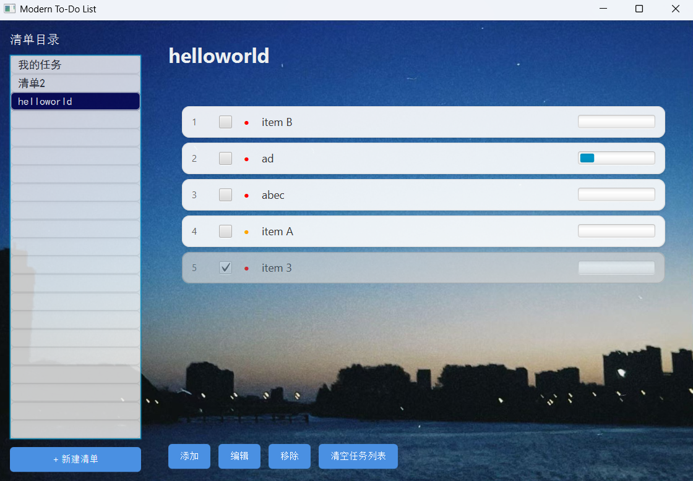

# JavaFX TodoList ✅

## 简介
这是一个使用 **JavaFX** + **Maven** 开发的简单待办事项（Todo List）桌面应用。该项目演示了基本的 UI 组件、JSON 数据持久化、对话框交互以及如何使用 `javafx-maven-plugin` 运行 JavaFX 应用。

---

## 主要功能 ✨

- 创建/编辑/删除待办事项
- 支持多个清单（TodoList）和每个清单的条目（TodoItem）
- 本地 JSON 文件（`demo/todo_data.json`）持久化数据
- 简单、可扩展的 UI：自定义 `ListCell` 与对话框用于编辑条目

---

## 项目结构 🔧

主要目录和文件说明：

- `demo/` - Maven 项目根目录
  - `pom.xml` - 构建配置（使用 Java 21、JavaFX 21）
  - `todo_data.json` - 示例数据文件（应用启动时加载/保存）
- `src/main/java/com/mv/` - 源代码
  - `App.java` - 程序入口（main / JavaFX Application）
  - `model/TodoItem.java` - 待办项模型
  - `model/TodoList.java` - 待办清单模型
  - `service/StorageService.java` - 负责 JSON 的读写（使用 Jackson）
  - `ui/TaskListCell.java` - 列表项自定义显示
  - `ui/TodoItemDialog.java` - 新建/编辑条目的对话框
- `src/main/resources/style.css` - 应用样式
- `docs/` - 文档和截图（比如 `docs/ui.png`）

---

## 运行与构建 ▶️

### 先决条件

- JDK 21（或兼容 Java 21 的运行环境）
- Maven

### 开发运行（不打包）

在项目根目录下运行：

```bash
mvn javafx:run -f demo/pom.xml
```

或切换到 `demo/` 目录后运行：

```bash
mvn javafx:run
```

### 打包

使用 Maven 打包：

```bash
mvn -f demo/pom.xml package
```

> 注意：打包后的运行可能需要额外配置 JavaFX 运行时依赖或使用 jlink 等工具生成运行时镜像。

---

## 测试 ✅

运行单元测试：

```bash
mvn -f demo/pom.xml test
```

---

## 开发指南 / 扩展建议 💡

- 想要增加新字段或属性，请修改对应的 `model` 类并更新 `StorageService` 的序列化/反序列化逻辑。
- 若要添加新的 UI 功能（例如过滤、搜索或拖放排序），建议在 `ui` 包中添加新的组件或扩展现有 `TaskListCell`。
- 可以将 `todo_data.json` 改为用户目录下的配置文件以实现持久化跨会话存储。

---

## 贡献者 / 许可

欢迎提交 PR 或 issue，简单描述你的改动或建议。

项目使用的许可证：查看仓库根目录 `LICENSE`。

---

## 截图



